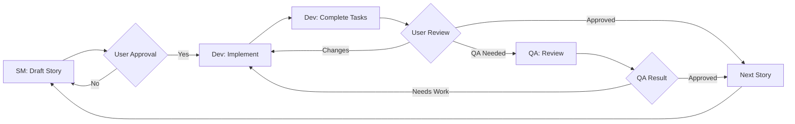

# BMad Method Core Concepts

## The Two-Phase Approach

BMad Method's key innovation is separating planning from development into two distinct phases, each optimized for its purpose.

### Phase 1: Planning (Web UI)
- **Environment**: Gemini Gems, ChatGPT, Claude web interface
- **Agents**: Analyst, PM, Architect, PO
- **Output**: PRD, Architecture, validated epics
- **Context**: Rich, document-heavy, exploratory

### Phase 2: Development (IDE)
- **Environment**: Cursor, VS Code, Claude Code
- **Agents**: SM, Dev, QA
- **Output**: Implemented code, one story at a time
- **Context**: Lean, focused, implementation-specific

## Context-Engineered Development

The genius of BMad is how it solves AI's context window limitations:

1. **Planning agents** create comprehensive documents with full context
2. **PO shards** these into bite-sized pieces
3. **SM** creates hyper-detailed story files with:
   - Complete implementation context
   - Specific code examples
   - Architecture references
   - Acceptance criteria
4. **Dev** opens one story file and has everything needed

## Story Files: The Secret Sauce

Story files are BMad's innovation for passing context between agents:

```yaml
# Example story structure
story:
  id: "S001"
  title: "Implement user authentication"
  context: |
    - Architecture: Microservices with JWT
    - Existing: No auth system yet
    - Dependencies: User service API
  
  implementation_details: |
    1. Create JWT utility in utils/auth.js
    2. Implement /api/auth/login endpoint
    3. Add middleware for route protection
    
  code_examples: |
    ```javascript
    // JWT structure expected:
    {
      userId: string,
      email: string,
      roles: string[]
    }
    ```
```

## Agent Collaboration Model

Agents pass information through files, not direct communication:

```
[Analyst] → project-brief.md
    ↓
[PM] → prd.md
    ↓
[Architect] → architecture.md
    ↓
[PO] → sharded-epics/, sharded-arch/
    ↓
[SM] → stories/S001.md, S002.md, ...
    ↓
[Dev] → implemented code
    ↓
[QA] → reviewed & refactored code
```

## Natural Language Framework

BMad contains NO code - everything is natural language instructions:

- **Agents**: Markdown files with personas and capabilities
- **Tasks**: Step-by-step procedures in English
- **Templates**: YAML with embedded generation instructions
- **Workflows**: YAML sequences describing processes

## The Development Cycle

The core cycle that makes BMad effective:



## Greenfield vs Brownfield

### Greenfield (New Projects)
- Start with ideation and market research
- Create PRD from scratch
- Design architecture without constraints
- Stories focus on building new features

### Brownfield (Existing Projects)
- Start by documenting current state
- PRD considers existing constraints
- Architecture shows current + target state
- Stories respect existing patterns and compatibility

## Knowledge Management

BMad provides multiple ways to inject knowledge:

1. **Technical Preferences** (`bmad-core/data/technical-preferences.md`)
   - Your preferred tech stack
   - Coding standards
   - Anti-patterns to avoid

2. **Project Documentation** (`docs/` folder)
   - Loaded by agents during startup
   - Dragged into chat as needed
   - Referenced in stories

3. **Knowledge Base** (`bmad-core/data/bmad-kb.md`)
   - Core BMad methodology
   - Best practices
   - Common patterns

## File Organization Patterns

```
project/
├── .bmad-core/          # BMad installation
├── docs/                # Project documentation
│   ├── prd.md          # Product requirements
│   ├── architecture.md  # Technical design
│   ├── epics/          # Sharded epics
│   ├── arch/           # Sharded architecture
│   └── stories/        # Implementation stories
├── src/                # Your actual code
└── bmad.config.js      # BMad configuration
```

## Why BMad Works

1. **Eliminates Planning Inconsistency**: Dedicated planning agents with rich context
2. **Solves Context Loss**: Stories contain complete implementation details
3. **Maintains Quality**: Structured review and validation processes
4. **Scales Naturally**: One story at a time prevents confusion
5. **Adapts to Domains**: Expansion packs for any field