# BMad Workflow Diagrams

## Overall BMad Method Flow

## Greenfield Planning Workflow

```mermaid
graph TD
    A[Start: Project Idea] --> B{Optional: Research?}
    B -->|Yes| C[Analyst: Market Research]
    B -->|No| D[Analyst: Project Brief]
    C --> D
    
    D --> E[Brief Created]
    E --> F[PM: Read Brief]
    F --> G[PM: Create PRD]
    
    G --> H[PRD Created]
    H --> I[Architect: Read PRD]
    I --> J[Architect: Create Architecture]
    
    J --> K[Architecture Created]
    K --> L[PO: Run Master Checklist]
    
    L --> M{Documents Aligned?}
    M -->|No| N[PO: Update Epics/Stories]
    N --> O[Update Docs as Needed]
    O --> L
    M -->|Yes| P[Planning Complete]
    
    P --> Q[📁 Switch to IDE]
    
    style P fill:#34a853,color:#fff
    style Q fill:#f9ab00,color:#fff
```

## Development Cycle Workflow

## Brownfield Workflow

## Story File Information Flow

## Agent Activation Flow

## Context Management Strategy

## Quick Decision Flow

